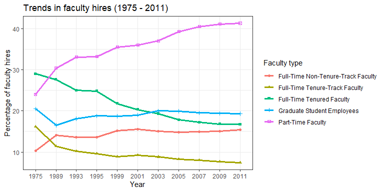

Lab 06 - Ugly charts and Simpson’s paradox
================
Ben Hardin
2/14/2023

### Load packages and data

``` r
library(tidyverse) 
library(dsbox)
library(mosaicData) 
```

``` r
#reading data
staff <- read.csv("data/instructional-staff.csv")

#clean the years
staff <- staff %>%
  rename("1975" = X1975, "1989" = X1989, "1993" = X1993, "1995" = X1995, "1999" = X1999, "2001" = X2001, "2003" = X2003, "2005" = X2005, "2007" = X2007, "2009" = X2009, "2011" = X2011)

#reshaping data
staff_long <- staff %>%
  pivot_longer(cols = -faculty_type, names_to = "year") %>%
  mutate(value = as.numeric(value))

staff_long
```

    ## # A tibble: 55 × 3
    ##    faculty_type              year  value
    ##    <chr>                     <chr> <dbl>
    ##  1 Full-Time Tenured Faculty 1975   29  
    ##  2 Full-Time Tenured Faculty 1989   27.6
    ##  3 Full-Time Tenured Faculty 1993   25  
    ##  4 Full-Time Tenured Faculty 1995   24.8
    ##  5 Full-Time Tenured Faculty 1999   21.8
    ##  6 Full-Time Tenured Faculty 2001   20.3
    ##  7 Full-Time Tenured Faculty 2003   19.3
    ##  8 Full-Time Tenured Faculty 2005   17.8
    ##  9 Full-Time Tenured Faculty 2007   17.2
    ## 10 Full-Time Tenured Faculty 2009   16.8
    ## # … with 45 more rows

### Exercise 1

``` r
staff_long %>%
  ggplot(aes(x = year, y = value, group = faculty_type, color = faculty_type))+
  geom_line(size = 1.1)+
  geom_point(aes(shape = faculty_type), size = 1.5)+
  theme_bw()+
  labs(title = "Trends in faculty hires (1975 - 2011)",
       y = "Percentage of faculty hires",
       x = "Year",
       color = "Faculty type",
       shape = "Faculty type")
```

    ## Warning: Using `size` aesthetic for lines was deprecated in ggplot2 3.4.0.
    ## ℹ Please use `linewidth` instead.

<!-- -->

### Exercise 2

``` r
ggplot(staff_long, aes(fill = faculty_type, x = year, y = value))+
  geom_bar(stat = "identity", position = "dodge")+
  theme_bw()+
  scale_fill_manual(values = c("Full-Time Non-Tenure-Track Faculty" = "grey", "Full-Time Tenure-Track Faculty" = "grey", "Full-Time Tenured Faculty" = "grey", "Graduate Student Employees" = "grey", "Part-Time Faculty" = "red"))
```

<!-- -->

### Exercise 3

…

Add exercise headings as needed.
