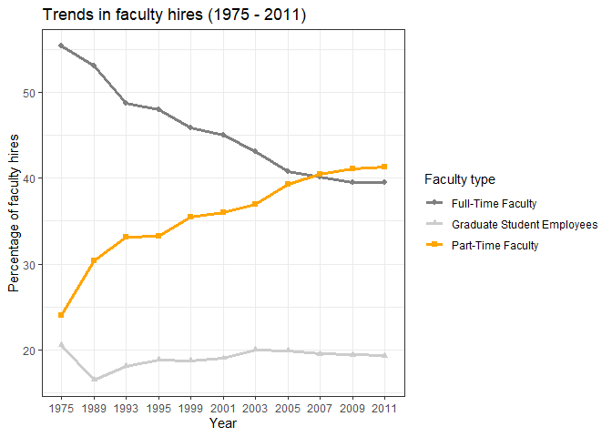
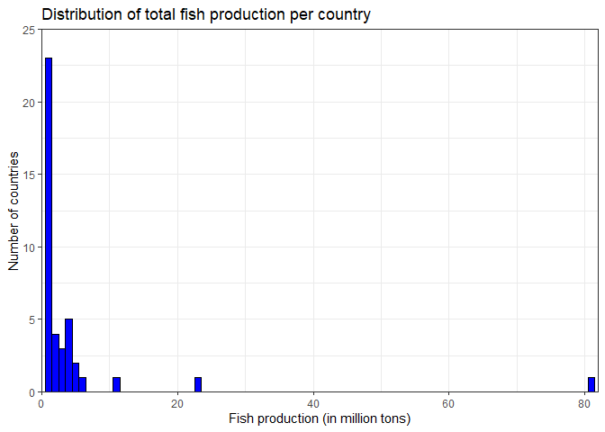
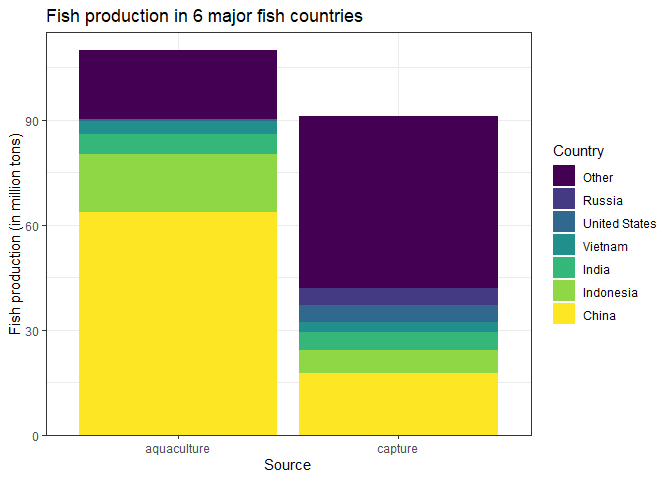
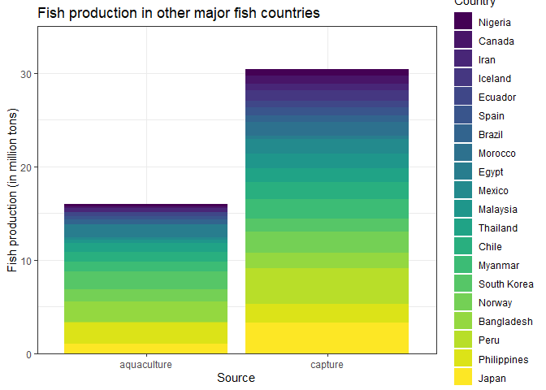
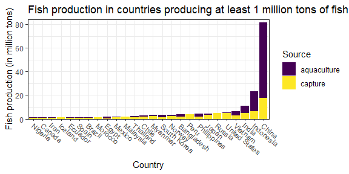
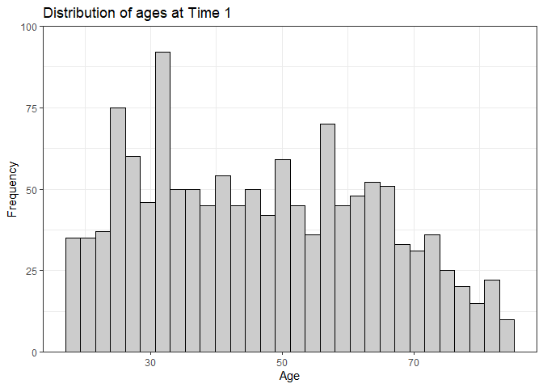
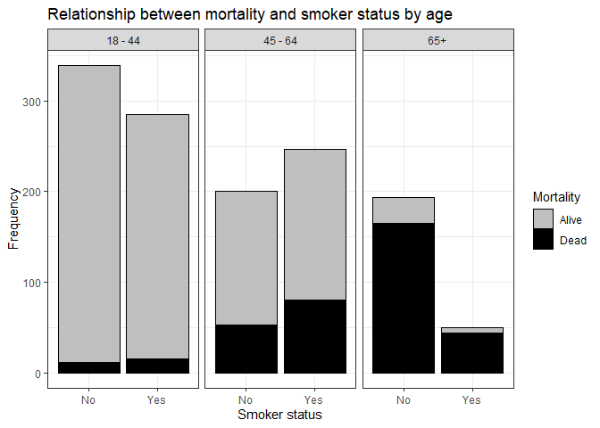

Lab 06 - Ugly charts and Simpson’s paradox
================
Ben Hardin
2/14/2023

### Load packages and data

``` r
library(tidyverse) 
library(dsbox)
library(mosaicData) 
```

``` r
#reading data
staff <- read.csv("data/instructional-staff.csv")

#clean the years
staff <- staff %>%
  rename("1975" = X1975, "1989" = X1989, "1993" = X1993, "1995" = X1995, "1999" = X1999, "2001" = X2001, "2003" = X2003, "2005" = X2005, "2007" = X2007, "2009" = X2009, "2011" = X2011)

#reshaping data
staff_long <- staff %>%
  pivot_longer(cols = -faculty_type, names_to = "year") %>%
  mutate(value = as.numeric(value))

staff_long
```

    ## # A tibble: 55 × 3
    ##    faculty_type              year  value
    ##    <chr>                     <chr> <dbl>
    ##  1 Full-Time Tenured Faculty 1975   29  
    ##  2 Full-Time Tenured Faculty 1989   27.6
    ##  3 Full-Time Tenured Faculty 1993   25  
    ##  4 Full-Time Tenured Faculty 1995   24.8
    ##  5 Full-Time Tenured Faculty 1999   21.8
    ##  6 Full-Time Tenured Faculty 2001   20.3
    ##  7 Full-Time Tenured Faculty 2003   19.3
    ##  8 Full-Time Tenured Faculty 2005   17.8
    ##  9 Full-Time Tenured Faculty 2007   17.2
    ## 10 Full-Time Tenured Faculty 2009   16.8
    ## # … with 45 more rows

### Exercise 1

Here is a new graph displaying how the proportion of different faculty
types making up new hires has changed over time.

``` r
staff_long %>%
  ggplot(aes(x = year, y = value, group = faculty_type, color = faculty_type))+
  geom_line(size = 1.1)+
  geom_point(aes(shape = faculty_type), size = 1.5)+
  theme_bw()+
  labs(title = "Trends in faculty hires (1975 - 2011)",
       y = "Percentage of faculty hires",
       x = "Year",
       color = "Faculty type",
       shape = "Faculty type")
```

    ## Warning: Using `size` aesthetic for lines was deprecated in ggplot2 3.4.0.
    ## ℹ Please use `linewidth` instead.

<!-- -->

### Exercise 2

I do think the plot does an ok job displaying how the proportion of
part-time faculty has increased dramatically compared to other
instructors, but this piece of information is obscured a little bit by
the amount of things happening in the plot, and that they are all about
equally prominent in the graph. For that reason, I want to propose
making 2 changes to the plot.

1.  Combining all full-time faculty into 1 category, so that we are only
    comparing 3 kinds of instructor types and not cluttering the graph
    quite so much.
2.  Making the line for part-time faculty brighter and more colorful
    than the other lines, so that our attention is drawn to the
    instructor type that we are most interested in learning about.

``` r
staff_long <-  staff_long %>%
  mutate(full_time = case_when(
    faculty_type == "Part-Time Faculty" ~ "Part-Time Faculty",
    faculty_type == "Graduate Student Employees" ~ "Graduate Student Employees",
    faculty_type %in% c("Full-Time Tenured Faculty", "Full-Time Tenure-Track Faculty", "Full-Time Non-Tenure-Track Faculty") ~ "Full-Time Faculty"))

staff_full <- aggregate(value ~ year + full_time, data = staff_long, FUN = sum)
```

``` r
ggplot(data = staff_full, aes(x = year, y = value, group = full_time, color = full_time))+
  geom_line(size = 1.1)+
  geom_point(aes(shape = full_time), size = 1.75)+
  theme_bw()+
  scale_color_manual(values = c("Full-Time Faculty" = "gray50", "Graduate Student Employees" = "gray80", "Part-Time Faculty" = "orange"))+
  labs(title = "Trends in faculty hires (1975 - 2011)",
       y = "Percentage of faculty hires",
       x = "Year",
       color = "Faculty type",
       shape = "Faculty type")
```

<!-- -->

I’m pretty pleased with the result! In particular, it highlights
something pretty striking that would have been really hard to deduce
from the previous graph – that since 2007, the proportion of part-time
faculty hires has actually exceeded the proportion of all full-time
faculty types combined! :0

### Exercise 3

``` r
fisheries <- read_csv("data/fisheries.csv")
```

    ## Rows: 216 Columns: 4
    ## ── Column specification ────────────────────────────────────────────────────────
    ## Delimiter: ","
    ## chr (1): country
    ## dbl (3): capture, aquaculture, total
    ## 
    ## ℹ Use `spec()` to retrieve the full column specification for this data.
    ## ℹ Specify the column types or set `show_col_types = FALSE` to quiet this message.

``` r
fisheries %>%
  mutate(new_total = total/1000000) %>%
  filter(total > 100000)%>%
ggplot(aes(x = new_total))+
  geom_histogram(binwidth = 1, color = "black", fill = "blue")+
  scale_y_continuous(expand = c(0, 0), limits = c(0, 25))+
  scale_x_continuous(expand = c(0, 0), limits = c(0, 82))+
  theme_bw()
```

    ## Warning: Removed 2 rows containing missing values (`geom_bar()`).

<!-- -->

``` r
fish_long <- fisheries %>%
  pivot_longer(cols = c(-total, -country), names_to = "type") %>%
  mutate(value = as.numeric(value))

fish_long %>%
  mutate(new_country = case_when(
    country == "China" ~ "China",
    country == "Indonesia" ~ "Indonesia",
    country == "India" ~ "India",
    country == "Vietnam" ~ "Vietnam",
    country == "United States" ~ "United States",
    country == "Russia" ~ "Russia",
    !country %in% c("China", "India", "Indonesia", "Vietnam", "United States", "Russia") ~ "Other")) %>%
  ggplot(aes(x = type, y = value, fill = fct_reorder(new_country, total)))+
  geom_bar(stat = "identity")
```

<!-- -->

``` r
fish_long %>%
  filter(!country %in% c("China", "India", "Indonesia", "Vietnam", "United States", "Russia"), total > 1000000) %>%
  ggplot(aes(x = type, y = value, fill = fct_reorder(country, value)))+
  geom_bar(stat = "identity")
```

<!-- -->

``` r
fish_long %>%
  filter(total > 1000000) %>%
  ggplot(aes(x = fct_reorder(country, value), fill = type, y = value))+
  geom_bar(stat = "identity")
```

<!-- -->

### Stretch Exercises

``` r
library(mosaicData)

data(Whickham)
```

### Exercise 1

The data is most likely observational, because it is described as a
survey conducted at 2 time points, and also because the IV is whether
someone is a smoker. Given the health risks involved in smoking, it is
unlikely that the researchers would have randomly assigned people to
become smokers for 20 years, which would be extremely unethical.

### Exercise 2

There are 1314 observations in the dataset, each of which represents a
woman in the town of Whickham.

### Exercise 3

There are 3 variables in the dataset, which represent:

1.  Whether the participant was still alive 20 years after the initial
    survey (dichotomous)
2.  The participants smoker status at the time of the initial survey
    (dichotomous)
3.  The participants age at the time of the initial survey (continuous)

``` r
ggplot(Whickham, aes(x = outcome))+
  geom_bar()
```

<!-- -->

``` r
ggplot(Whickham, aes(x = smoker))+
  geom_bar()
```

<!-- -->

``` r
ggplot(Whickham, aes(x = age))+
  geom_histogram(color = "black", fill = "grey80")
```

    ## `stat_bin()` using `bins = 30`. Pick better value with `binwidth`.

<!-- -->

### Exercise 4

My expectation would be that smoking would be associated with worse
health outcomes. In this case, that would mean greater or earlier
mortality among smokers.

### Exercise 5

Based on the visualization, people who reported being smokers at time 1
don’t seem to differ much from people who reported not being smokers in
terms of their likelihood of surviving to time 2. The conditional
probabilities reveal that, apparently contrary to my prediction, smokers
were descriptively less likely to have died by time 2 than non-smokers.

``` r
ggplot(Whickham, aes(x = smoker, fill = outcome))+
  geom_bar(position = "fill")
```

<!-- -->

``` r
Whickham %>%
  count(smoker, outcome) %>%
  group_by(smoker) %>%
  mutate(prob_dead = n/sum(n))
```

    ## # A tibble: 4 × 4
    ## # Groups:   smoker [2]
    ##   smoker outcome     n prob_dead
    ##   <fct>  <fct>   <int>     <dbl>
    ## 1 No     Alive     502     0.686
    ## 2 No     Dead      230     0.314
    ## 3 Yes    Alive     443     0.761
    ## 4 Yes    Dead      139     0.239

### Exercise 6

``` r
Whickham <- Whickham %>%
  mutate(age_cat = case_when(
    age <= 44 ~ "18 - 44",
    age > 44 & age <= 64 ~ "45 - 64",
    age > 64 ~ "65+"))
```

### Exercise 7

Not too surprisingly, the likelihood of mortality was much higher for
people who were 65 and above at time 1, and much lower for people
between 18-44. For younger people, the those who were smokers were
somewhat more likely to have died by time 2 than non-smokers. For 65 and
older people, if we were to only focus on comparing the “dead” columns,
it would look like more non-smokers than smokers are dying. However,
when we compare the size of the bars, we can see that very few smokers
above the age of 65 were ever surveyed, and a higher proportion of them
died compared to non-smokers over 65. The original plot was misleading
about the effect, because a majority of 65+ individuals died regardless
of their smoker status and there weren’t very many 65+ smokers available
to sample in the first place. Combining all the age categories together
masked these nuances of the data. This is an example of Simpson’s
paradox.

``` r
ggplot(Whickham, aes(x = smoker, fill = outcome))+
  facet_wrap(~ age_cat)+
  geom_bar()
```

<!-- -->

``` r
Whickham %>%
  count(smoker, outcome, age_cat) %>%
  pivot_wider(names_from = age_cat, values_from = n)
```

    ## # A tibble: 4 × 5
    ##   smoker outcome `18 - 44` `45 - 64` `65+`
    ##   <fct>  <fct>       <int>     <int> <int>
    ## 1 No     Alive         327       147    28
    ## 2 No     Dead           12        53   165
    ## 3 Yes    Alive         270       167     6
    ## 4 Yes    Dead           15        80    44
